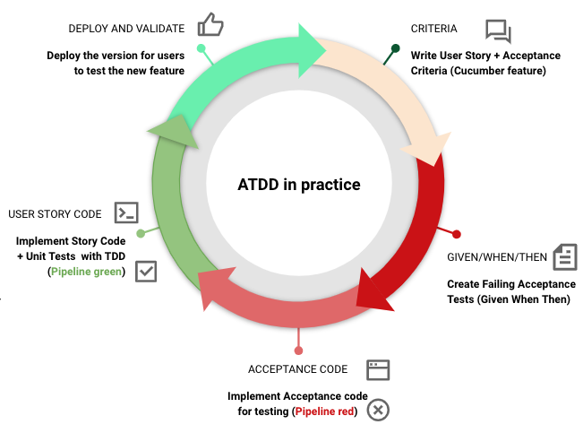

# reactive-atdd-workshop

[](https://github.com/juan-zumer/reactive-atdd-workshop/actions/workflows/gradle.yml)
[](http://codecov.io/gh/juan-zumer/reactive-atdd-workshop)
[](https://sonarcloud.io/dashboard/index/com.thoughtworks:reactive-atdd-workshop)
[](https://opensource.org/licenses/Apache-2.0)

Reactive Acceptance Test Driven Development (ATDD) workshop with Spring WebFlux and Cucumber.

## Context
**[ATDD](https://www.agilealliance.org/glossary/atdd)** stands for Acceptance Test Driven Development. "_ATDD involves team members with different perspectives (customer, development, testing) collaborating to write acceptance tests in advance of implementing the corresponding functionality_".

We used **[Behaviour Driven Development (BDD)](https://www.agilealliance.org/glossary/bdd)** to link the business language to technical testing through [Gherkin DSL](https://cucumber.io/docs/gherkin/reference/). "_BDD offers more precise guidance on organizing the conversation between developers, testers and domain experts_"

**[Cucumber](https://cucumber.io/docs/guides/overview/)** is a tool that supports BDD. Cucumber allows to specify different scenarios using [Gherkin syntax](https://cucumber.io/docs/guides/overview/#what-is-gherkin) written using [Given/When/Then](https://www.agilealliance.org/glossary/gwt/) steps.

**[Reactive Programming](https://www.baeldung.com/java-reactive-systems)** provides the following benefits when designing your architecture:

- **Asynchronous and non-blocking event-driven architecture**
- **Responsiveness**, quick and consistent service
- **Elastic** under unpredictable workloads
- **Resiliency**, through replication and isolation in case of system failures

Reactive systems are more flexible, loosely-coupled and scalable.

## ATDD Cycle

Let's explain how we applied the ATDD cycle in a real example of Reactive Programming:

<p align="center">
	
</p>

- ATDD helps to discuss in advance the features to be implemented. Firstly, we discuss and agree focus on the User Story agreed taking into account different perspectives (business, development and testing). Then, we write the User Story using Cucumber features and scenarios (as  a user, I want, To):
```
    Feature: Retrieve the amount of my assets
      Scenario: As a crypto wallet user, I want to retrieve my past assets increments to know my overall amount of crypto assets
        Given that we have stored data on the amount of crypto assets we have acquired in the past
        When I request the amount of my assets
        Then I get the list of the increments of amount of my assets
```
- Secondly, we write the failing acceptance tests using Given/When/Then approach:
```
    @Given("that we have stored data on the amount of crypto assets we have acquired in the past")
    public void setup() {
        log.info("Before any test execution");
    }

    @When("I request the amount of my assets")
    public void whenIRequestTheAmountOfMyAssets() {
        log.info("Running: I request the amount of my assets at " + new Date());
        assets = getAssets().collectList().block();
    }

    @Then("I get the list of the increments of amount of my assets")
    public void thenIGetTheListOfTheIncrementsOfAmountOfMyAssets() {
        log.info("Running: I get the list of the increments of amount of my assets at " + new Date());

        assertEquals(3, assets.size());
        assertAll("asset",
                () -> assertTrue(assets.contains(new Asset("1", "BTC", 0.1))),
                () -> assertTrue(assets.contains(new Asset("2", "BTC", 0.2))),
                () -> assertTrue(assets.contains(new Asset("3", "BTC", 0.05)))
        );
    }
```
- Thirdly, we create the Acceptance code for the criteria defined. Remember that at this point the tests continue failing. We generate acceptance reports for the user to check it is ok:

<p align="center">
	
</p>

- Next, we write the Unit tests and the code for the User Story to pass them

<p align="center">
	
</p>

- Finally, we deploy a version with the new functionality for the users to test 
 
## Description
The PoC provides a very simple wallet management of crypto assets using Reactive Programming. It exposes an API with these operations:
- [GET] `/status`, get the status of the system
- [GET] `/price/btc`, get the current BTC spot price
- [GET] `/assets`, get all the assets stored
- [POST] `/assets`, create a new asset value
- [GET] `/assets/{assetId}`, get asset by id
- [DEL] `/assets/{assetId}`, remove asset by id
- [GET] `/name/{name}`, get asset by name
- [GET] `/value`, get the value of all the assets stored retrieving the current spot price from Coinbase

For further information check the Swagger configuration

## Technology
- Java 11+
- Gradle for Java Dependency Management
- Spring WebFlux for Reactive Programming
- Spring Cucumber (and Gherkin) for the Acceptance Tests
- Lombok for the models
- Terraform for provisioning the GKE cluster
- Google Cloud Platform
- CI pipeline with GitHub actions, SonarCloud and CodeCov

### Spring WebFlux
[Spring WebFlux](https://www.baeldung.com/spring-webflux) provides Reactive Programming support. It internally uses [Project Reactor](https://projectreactor.io) and its two reactive and composable APIs [Flux [N]](https://projectreactor.io/docs/core/release/api/reactor/core/publisher/Flux.html) and [Mono [0|1]](https://projectreactor.io/docs/core/release/api/reactor/core/publisher/Mono.html).

### Spring Cucumber

We use [Spring Cucumber](https://josdem.io/techtalk/spring/spring_webflux_cucumber_es/) to write the acceptance tests:
- The `*.feature` files, where we define the scenarios are in `./test/resources/` folder
- We [configure gradle]() to run them as integration tests
- The source code for the tests are in `./test/acceptance` folder written as `Given/When/Then` clauses. Remember that the text MUST be the same used in the `*.feature` file to associate the description with the actual test
- When execute `gradlew integrationTest`, it generates `cucumber-report.html` located at `./build/reports/` folder.

### Terraform
We use Hashicorp scripts to [create a GKE cluster in GCP](https://learn.hashicorp.com/tutorials/terraform/gke) with some modifications. Requirements:
- Terraform
- GCP account
- Configure gcloud SDK

Request permissions to interact with GCP
```
gcloud init
gcloud auth application-default login
```
Enable GKE services and Container Registry APIs
```
gcloud services enable \
	containerregistry.googleapis.com \
	container.googleapis.com
```
Modify `terraform.tfvars` including the `project_id` and `region` variables and execute:

```
terraform init
terraform apply
```

We included a [GitHub action to deploy the container to GKE](https://docs.github.com/en/actions/guides/deploying-to-google-kubernetes-engine). Before we need to:
- Create a service account with admin roles on container and storage
- Generate the JSON key for the service account

Create a service account
```
$ gcloud iam service-accounts create $SA_NAME
```

Retrieve the email of the service account created
```
$ gcloud iam service-accounts list
```
Assign these permissions for the deployment to happen:

* Kubernetes Engine Admin
* Kubernetes Engine Developer
* Storage Admin

```
$ gcloud projects add-iam-policy-binding $PROJECT_ID \
  --member=serviceAccount:$SA_EMAIL \
  --role=roles/container.admin \
  --role=roles/storage.admin
```
Download the JSON keyfile for the service account
```
$ gcloud iam service-accounts keys create key.json --iam-account=$SA_EMAIL
```
Copy the content of the JSON keyfile and store it in a GitHub secret (GKE_SA_KEY):
```
$ cat key.json | base64
```

And configure two secrets in GitHub:
- `GKE_PROJECT` with the GCP `project_id`
- `GKE_SA_KEY` with the JSON key value

## How to build and deploy
Run the unit tests:
```
./gradlew test
```

Run the acceptance tests. For the moment, to execute properly, they need the application deployed:
```
./gradlew bootRun
./gradlew integrationTest
```

Compile and package the project with

```
./gradlew clean bootJar
```

and execute

```
java -jar ./build/libs/reactive-atdd-workshop*.jar
```

It can also be run as:

```
./gradlew bootRun
```

Go to your browser and type `http://localhost:8080/swagger-ui/`

## Docker deployment

### Full stack deployment using docker-compose

The project comes with a [docker-compose](https://docs.docker.com/compose/) which could handle the deployment of specific databases to use in the project:

0. Check the `docker-compose.yml` script
1. Execute `docker-compose up -d`
2. Wait until the stack is deployed. Check the logs with `docker logs --details reactive-atdd-workshop`
3. Check the Swagger configuration created at `http://localhost:8080/swagger-ui/`

### Simple deployment

Generate the jar:
```
./gradlew clean bootJar
```

Build the image:
```
docker build -t thoughtworks/reactive-atdd-workshop .
```

Run the image:

```
docker run --name reactive -d thoughtworks/reactive-atdd-workshop
```

## Material

- [Spring WebFlux](https://www.baeldung.com/spring-webflux)
- [ATDD from the trenches](https://www.infoq.com/articles/atdd-from-the-trenches/)
- [Driving Development with Tests: ATDD and TDD](http://testobsessed.com/wp-content/uploads/2011/04/atddexample.pdf)
- [Reactive Systems in Java](https://www.baeldung.com/java-reactive-systems)
- [What is Cucumber?](https://cucumber.io/docs/guides/overview)
- [Cucumber 10 Minute Tutorial](https://cucumber.io/docs/guides/10-minute-tutorial/)
- [Cucumber Gherkin Reference](https://cucumber.io/docs/gherkin/reference/)
- [Acceptance TDD with Cucumber](https://www.ctl.io/developers/blog/post/acceptance-tdd-cucumber)
- [Spring Cucumber](https://josdem.io/techtalk/spring/spring_webflux_cucumber_es/)
- [How to Configure Integration Testing with Gradle](https://www.petrikainulainen.net/programming/gradle/getting-started-with-gradle-integration-testing/)
- [Deploying to Google Kubernetes Engine](https://docs.github.com/en/actions/guides/deploying-to-google-kubernetes-engine)
- [Provision a GKE Cluster with Terraform](https://learn.hashicorp.com/tutorials/terraform/gke)

## License

Apache 2.0

By downloading this software, the downloader agrees with the specified terms and conditions and the particularities of the license provided.